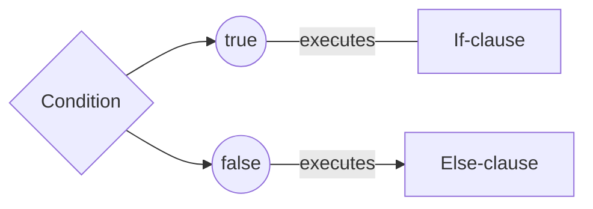

---
sidebar_position: 8
---

# Conditionals

Learn about conditional execution of blocks of code.

Conditionals are ways to allow the program to take one of different actions depending on some predefined condition.
The conditionals in **ABJAD** are represented by if-statements and the if-else statements.

## What do They Consist of? {#what-do-they-consist-of}

Conditionals consist of three parts:


|     Part     | Required/Optional |  Type   |                    Function                    |
|:------------:|:-----------------:|:-------:|:----------------------------------------------:|
|  Condition   |     Required      | Boolean |   Decides the execution path of the program    |
|  If-clause   |     Required      |  Block  | Executes when the condition evaluates to true  |
| Else-clauses |     Optional      |  Block  | Executes when the condition evaluates to false |


## How They Work? {#how-they-work}



## Syntax {#syntax}
### Without Else-Clause {#syntax-without-else-clause}

```abjad
متغير منطق عشرة_إيجاب = 10 > 0؛
إذا(عشرة_إيجاب) {
   أكتب("الرقم عشرة إيجابي")؛
}
```

### With Else-Clause {#syntax-with-else-clause}

```abjad
متغير منطق مزدوج = 7 % 2 == 0؛
إذا(مزدوج) {
   أكتب("الرقم مزدوج")؛
} وإلا {
   أكتب("الرقم ليس مزدوج")؛
}
```

### Nesting If-Else Statements {#syntax-nesting-if-else-statements}

```abjad
متغير رقم اول = 10؛
متغير رقم ثاني = 20؛

إذا (أول > ثاني) {
  أكتب("الرقم الأول أكبر")؛
} وإلا إذا (ثاني > أول) {
  أكتب("الرقم الثاني أكبر")؛
} وإلا {
  أكتب("الرقمان متساويان")؛
}

```