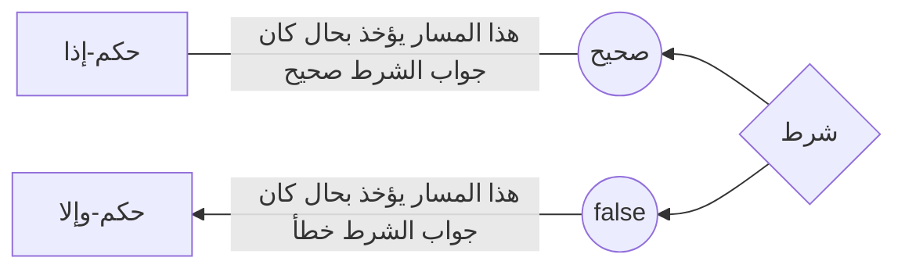

---
sidebar_position: 8
---

# الشّرطيات

تعلّم\ي عن التشغيل المشروط لمقاطع الكود.

الشَّرطيات وسيلةٌ لجعل البرنامج يأخذ واحدًا من عدة مسارات مختلفة، وذلك بناءًا على شرطٍ مُعرفٍ مُسبقًا.

لذلك، نستعمل في أبجد الجمل الشرطية مستخدمين الكلمة المفتاح `إذا` و `وإلا`

## مما تتألف? {#what-do-they-consist-of}

تتألّف الجمل الشرطية من ثلاثة عناصر:


|  العنصر   | أساسي\اختياري |   نوعه   |                            وظيفته                            |
|:---------:|:-------------:|:--------:|:------------------------------------------------------------:|
|   الشرط   |     أساسي     |   منطق   |                يُحدد مسار سير تشغيل البرنامج                 |
| حُكم-إذا  |     أساسي     | وحدة كود | تحتوي على الكود الذي يتم تشغيله في حال كان جواب الشرط `صحيح` |
| حُكم-وإلا |    اختياري    | وحدة كود | تحتوي على الكود الذي يتم تشغيله في حال كان جواب الشرط `خطأ`  |


## كيف تعمل؟ {#how-they-work}



## الصياعة {#syntax}
### بدون حكم-وإلا {#syntax-without-else-clause}

```abjad showLineNumbers
متغير منطق عشرة_إيجاب = 10 > 0؛
إذا(عشرة_إيجاب) {
   أكتب("الرقم عشرة إيجابي")؛
}
```

### مع حكم-وإلا {#syntax-with-else-clause}

```abjad showLineNumbers
متغير منطق مزدوج = 7 % 2 == 0؛
إذا(مزدوج) {
   أكتب("الرقم مزدوج")؛
} وإلا {
   أكتب("الرقم ليس مزدوج")؛
}
```

### تداخل الجمل الشرطية {#syntax-nesting-if-else-statements}

```abjad showLineNumbers
متغير رقم اول = 10؛
متغير رقم ثاني = 20؛

إذا (أول > ثاني) {
  أكتب("الرقم الأول أكبر")؛
} وإلا إذا (ثاني > أول) {
  أكتب("الرقم الثاني أكبر")؛
} وإلا {
  أكتب("الرقمان متساويان")؛
}
```